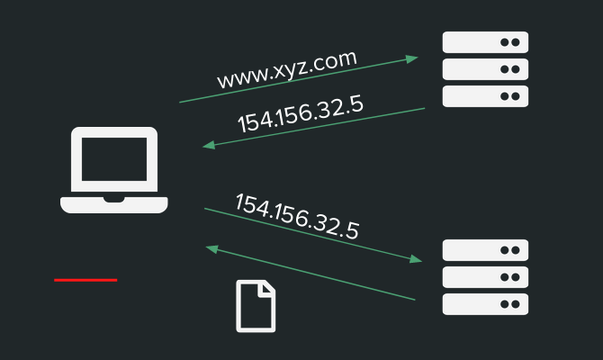
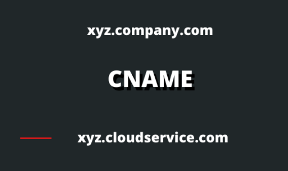
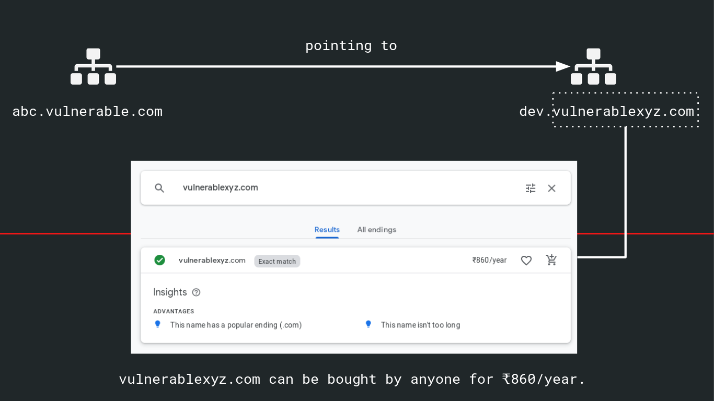

# Subdomain Takeover

## Basics

### DNS

* When a web address is accessed eg. "www.xyz.com", a DNS query is performed across a DNS server with the host name.
* The DNS server takes the hostname and resolves it into a numeric IP address 

### CNAME

* An alias of domain name to another domain name
* In the example below, xyz.company.com is a source domain and xyz.cloudservice.com is a canonical domain name.

* Subdomains map themselves to a specific IP, 3rd party services like Azure, AWS, Heroku, Github, Fastly, Shopify, etc. to serve the contents. These subdomains use a CNAME record to another domain [eg. xyz.company.com CNAME xyz.cloudservice.com]
* Now due to whatever reason, the company decides to stop utilizing this service and to save some bucks, the company cancels the subscription of the 3rd party cloud service provider.
* But, the company forgets to update or simply remove the CNAME record in the DNS zone file
* Since the CNAME record is not deleted from company.com DNS zone, anyone who registers xyz.cloudservice.com has full control over xyz.company.com until the DNS record is present.

## How to find subdomain takeover ?

### 1. Subdomain Enumeration
Use the following tools to enumerate subdomains
* [Assetfinder](https://github.com/tomnomnom/assetfinder)
* [Subfinder](https://github.com/projectdiscovery/subfinder)
* [Findomain](https://github.com/Edu4rdSHL/findomain)

### 2. Checking for takeover
The following tools are designed to scan a list of subdomains concurrently and identify ones that are able to be hijacked.
* [Subjack](https://github.com/haccer/subjack)
* [SubOver](https://github.com/Ice3man543/SubOver)

You can also verify if the subdomain is vulnerable or not by going through common error pages.
### 3. Hijacking the subdomain
Use the following github repositiory to check if the engine is vulnerable or not and the steps for hijacking a particular engine.
* [https://github.com/EdOverflow/can-i-take-over-xyz](https://github.com/EdOverflow/can-i-take-over-xyz)

If you cannot find your engine in the above repository, [Google](https://www.google.com) is your friend !

# Case : CNAME available to buy

* There are cases when the CNAME that a subdomain points to, is available to buy. 
* In that case the attacker can directly buy that domain and host his/her content.

### References
[How we Hijacked 26+ Subdomains](https://medium.com/@aishwaryakendle/how-we-hijacked-26-subdomains-9c05c94c7049)

[Subdomain Takeover: Finding Candidates](https://0xpatrik.com/subdomain-takeover-candidates/)

[Subdomain Takeover: Proof Creation for Bug Bounties](https://0xpatrik.com/takeover-proofs/)

#### Check out our talk on the same at NULL / OWASP Bangalore meetup, June 2020
[https://www.youtube.com/watch?v=xCunHBH8ZQ4](https://www.youtube.com/watch?v=xCunHBH8ZQ4)

# Authors:
[@aish_kendle](https://twitter.com/aish_kendle)

[@thakare_prateek](https://twitter.com/thakare_prateek)

